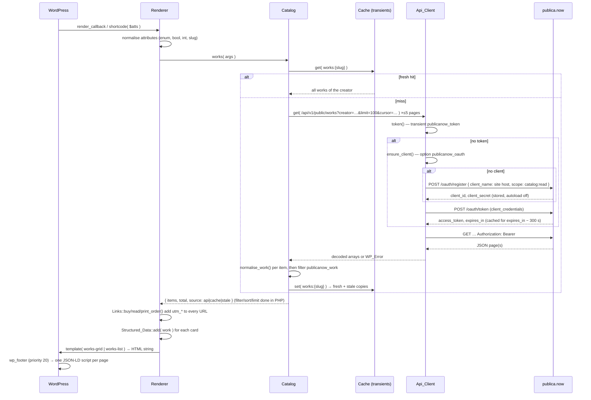

# Publica.now for WordPress — architecture

How a block on a WordPress page turns into a rendered catalog whose buttons land on
publica.now, what the plugin stores, which hooks it exposes, and how themes override its
markup. Derived from the build contract in [`PLAN.md`](PLAN.md) §7; where this document
and the contract disagree, the contract wins.

## 1. The one-paragraph model

The plugin is a **read-only client of the publica.now public catalog API** with a
**rendering layer** in front of it. publica.now is the store of record; WordPress only
displays. Every request follows the same path:

```
render (block render.php / shortcode)
  → Renderer      normalises attributes, picks a template, escapes
    → Catalog     typed reads + normalisation into ONE work / creator shape
      → Cache     fresh transient (15 min) → stale transient (7 days)
        → Api_Client   wp_remote_get with a bearer token
          → OAuth      client_credentials token, minted from a self-registered client
```

Nothing runs on cron and nothing runs on the visitor's browser: fetches happen
server-side during page render, and only when the cache is cold.

## 2. Request flow in detail

### 2.1 Rendering a catalog



Key decisions encoded in that diagram:

- **All works of a creator are fetched and cached once.** Filtering by content type,
  free/paid, ids/exclude, ordering and limiting happen in PHP. A page with five
  catalog blocks costs one API round-trip (or zero, when cached), and the API's cursor
  pagination (100 per page, max 5 pages) is invisible to templates.
- **The token is minted lazily** and cached for `expires_in − 300` seconds (~55 minutes).
  Publica.now tokens are 1-hour opaque client-credentials tokens with no refresh; a
  fresh mint is cheaper than refresh logic.
- **The client is registered once per site** (`POST /oauth/register`, RFC 7591) with the
  site host as `client_name` and the read-only `catalog:read` scope. A leaked secret can
  only read public data faster.
- **Normalisation happens in exactly one place** (`Catalog::normalise_work()` /
  `normalise_creator()`), so templates, JSON-LD and links all consume the same shape
  regardless of whether the API is today's production payload or the Layer-1 payload
  (`checkout_url`, `print`, `discount`, `rating`, `format`, `language` are optional on
  read and have contract-defined fallbacks).

### 2.2 Rendering one work or one button

Same path, narrower read: `Catalog::work( $id_or_slug )` first looks for the work in the
connected creator's cached list; only when absent does it call
`GET /api/v1/public/works/{id|slug}` and cache that single work. `Renderer::button()`
chooses a URL by `format`: `digital` → `Links::buy()` or `Links::read()`, `print` →
`Links::print_order()`, `auto` → the primary button the card would show.

### 2.3 Failure path — never a blank block

```
Api_Client returns WP_Error (publicanow_http | publicanow_oauth | publicanow_not_found |
                             publicanow_rate_limited | publicanow_invalid_slug | publicanow_not_connected)
  → Catalog tries Cache::get_stale()            served with source = 'stale' (up to 7 days old)
    → no stale copy: Renderer renders templates/empty.php
        visitors: a quiet link to the creator's publica.now page
        admins (manage_options): the error message inline, with what to do
```

`WP_Error::get_error_data()` carries `status` and `retry_after` when the API said so.
Rate limits (publica.now: 10 registrations/hour/IP, 60 token calls/minute/IP) surface as
`publicanow_rate_limited` and are absorbed by the stale copy.

### 2.4 Connecting (admin)

```
Settings → Publica.now → Connect (POST, nonce publicanow_connect, cap manage_options)
  → Settings::connect( input )
    → Catalog::normalise_slug()      accepts https://publica.now/creators/{slug} or a bare slug
                                     validates ^[a-z0-9][a-z0-9-]{0,189}$ → publicanow_invalid_slug
    → Catalog::creator( slug, bypass_cache = true )
        → Api_Client (registers client + mints token on first use)
        → GET /api/v1/public/creators/{slug}    404 → publicanow_not_found
    → option publicanow_creator = normalised creator + fetched_at + website_matches
    → option publicanow_settings[creator_slug]
    → do_action( 'publicanow_connected', $creator )
```

`website_matches` compares the host of the creator's publica.now `website` with
`home_url()`'s host. It drives the "verified website" badge and nothing else: the
catalog is public data, so ownership is informational, never a gate.

The same operations exist as REST routes for the editor and admin script:
`POST /publica-now/v1/connect`, `/disconnect`, `/purge` (`manage_options`),
`GET /works?search=&content_type=` and `GET /status` (`edit_posts`), all behind a
`wp_rest` nonce localised as `publicanowAdmin` / `publicanowEditor`.

## 3. What the plugin stores

Everything lives in the options and user-meta tables; the plugin writes no files.

| Where | Key | Autoload | Content | Lifetime |
| --- | --- | --- | --- | --- |
| option | `publicanow_settings` | yes | `creator_slug`, `open_in_new_tab` (false), `cache_ttl` (900), `default_columns` (3), `default_layout` (`grid`), `show_excerpt` (true), `show_rating` (true), `button_text` ('') | until uninstall |
| option | `publicanow_oauth` | **no** | `client_id`, `client_secret`, `registered_at`, `scope` | until Disconnect / uninstall (revoked first) |
| option | `publicanow_creator` | yes | last validated creator payload + `fetched_at` + `website_matches` | until Disconnect / uninstall |
| option | `publicanow_activated_at` | yes | Unix time of first activation; drives the one-time connect notice | until uninstall |
| option | `publicanow_cache_gen` | yes | integer generation counter mixed into cache keys so a purge is O(1) even on object caches that cannot enumerate keys | until uninstall |
| transient | `publicanow_token` | — | bearer token | `expires_in − 300` s |
| transient | `publicanow_c_{md5}` | — | fresh cache entry (`works:{slug}`, `work:{id}`, `creator:{slug}`) | `cache_ttl` (default 900 s, filter `publicanow_cache_ttl`) |
| transient | `publicanow_s_{md5}` | — | stale copy of the same entry | 7 days |
| user meta | `publicanow_notice_dismissed` | — | the admin dismissed the connect notice | until uninstall |

**Purge** (`Cache::purge()`, the Refresh button, `POST /purge`, deactivation, uninstall):
bumps the generation, deletes `_transient_publicanow_%` and
`_transient_timeout_publicanow_%` rows through `$wpdb` LIKE, flushes the `publicanow`
object-cache group where supported, then fires `publicanow_cache_purged`.

**Deactivation** drops cache and token but keeps settings and the OAuth client, so
re-activating does not re-register. **Uninstall** (`uninstall.php`) revokes the client
(`POST /oauth/revoke`), then deletes every option, transient and user-meta row above.
On multisite each site has its own set; network activation loops over sites.

### 3.1 What leaves the site

Only three things, and only after an administrator clicks Connect:

1. the creator slug the admin entered;
2. the site host (`wp_parse_url( home_url(), PHP_URL_HOST )`) — as `client_name` at
   registration and as `utm_source` on outbound links;
3. ordinary HTTP request metadata (server IP, user agent `PublicaNow-WordPress/{version}`).

No visitor data is ever sent by PHP. Visitors' browsers do load cover images from
publica.now (`/works/{id}/cover`, a stable route) and follow the Buy / Read free / Order
paperback links there. This is what `readme.txt` → *External Services* discloses.

## 4. The normalised shapes

Every consumer (templates, JSON-LD, links) reads these and nothing else. Every key is
always present; `null` only where marked.

**Work**

```
id, title, slug, content_type (stored value), kind (ebook|audiobook|music|video|course|zine|photography|design|print|other),
description|null, author, creator {id,name,slug,url}, url, cover_url|null,
is_free (bool), price_cents (int|null, effective), list_price_cents (int|null), currency (upper, 'USD' default),
discount {percent_off:int, ends_at:string}|null, checkout_url|null, print {price_cents,currency,order_url}|null,
rating {average:float,count:int}|null, format|null, language|null, published_at|null
```

Fallbacks when the API predates Layer 1: `checkout_url` = `{base}/checkout/{slug}` if
`!is_free && kind !== 'print'`; `list_price_cents` = `price_cents`; `author` =
`creator.name`; `print`, `rating`, `format`, `language`, `discount` = `null`; `kind`
derived from `content_type` (`literary` → `ebook`). The `publicanow_work` filter runs
last.

**Creator**

```
id, name, slug, url, bio|null, works_count, avatar_url|null, website|null, accepts_support
```

## 5. Links and attribution

`Links::buy( $work )` → `checkout_url`; `Links::read( $work )` → `url`;
`Links::print_order( $work )` → `print.order_url`; `Links::creator( $creator )` →
creator `url`. Each appends:

| arg | value |
| --- | --- |
| `utm_source` | site host |
| `utm_medium` | `wordpress_plugin` |
| `utm_campaign` | `publica-now-plugin` |

filtered through `publicanow_link_args( array $args, array $work, string $kind )`.
publica.now's `CaptureAttribution` middleware stores these on the first GET and
`PurchaseAttribution` carries them onto the purchase, so attribution needs no server
change on either side.

Button choice: `print` kind → print button only; `is_free` → **Read free** (+ **Order
paperback** if `print`); paid → **Buy** (+ **Order paperback** if `print`). Labels pass
through `publicanow_button_label( string $label, string $kind, array $work )` and the
`button_text` attribute/setting. Links get `rel="noopener"` and, when the setting says
so, `target="_blank"`.

## 6. Rendering, templates and theme overrides

`Renderer::catalog( $atts )`, `::work( $atts )`, `::button( $atts )` return HTML strings
and are the only entry points used by blocks (`blocks/*/render.php`) and shortcodes
(`class-shortcodes.php`). Block and shortcode attributes share names and defaults
(`PLAN.md` §7). The stylesheet `publica-now` is enqueued on first render (and on
`enqueue_block_assets` for the editor); no JavaScript is loaded on the front end.

Templates are plain PHP files that receive a `$vars` array and escape their own output:

| Template | Used by |
| --- | --- |
| `templates/works-grid.php` | catalog, `layout=grid` |
| `templates/works-list.php` | catalog, `layout=list` |
| `templates/work-card.php` | one card (grid cells, `work` block `layout=card`) |
| `templates/work-inline.php` | `work` block `layout=inline` |
| `templates/buy-button.php` | the button, alone or inside cards |
| `templates/empty.php` | any `WP_Error` / empty result |

Resolution order in `Renderer::template( $name, $vars )`:

1. `locate_template( 'publica-now/' . $name . '.php' )` — child theme, then parent theme;
2. the plugin's `templates/{name}.php`.

Variables pass through `publicanow_template_vars( array $vars, string $template )` first.
Wrapper elements carry `class="publicanow publicanow-{surface} {class}"` and
`data-publicanow-creator="{slug}"`; cards are `.publicanow-card`, badges
`.publicanow-badge`, buttons `.publicanow-button` (primary: `.is-primary`). Design tokens
are CSS custom properties: `--publicanow-accent` (`#E05A2B`, dark `#FF6B35`),
`--publicanow-ink` (`#1A1816`), `--publicanow-muted` (`#6B6560`), `--publicanow-radius`
(`12px`), `--publicanow-cover-shadow`. The font family is inherited from the theme.
Coral is used only on the primary button and the sale price.

## 7. Structured data

`Structured_Data::instance()->add( array $work )` is called for every rendered work.
At `wp_footer` (priority 20) the collector prints **one** `<script
type="application/ld+json">` per page: a single `Book` / `Audiobook` / `Product` when one
work was rendered, otherwise an `ItemList` of them. Each item has an `Offer` whose `url`
is the publica.now checkout/work page, `priceValidUntil` when a sale is live and
`aggregateRating` when the work has ratings. Filter: `publicanow_jsonld( array $graph )`;
`add_filter( 'publicanow_jsonld', '__return_empty_array' )` disables output.

## 8. Hooks (public API)

**Filters**

| Hook | Signature | Purpose |
| --- | --- | --- |
| `publicanow_api_base` | `( string $base )` | API host, default `PUBLICANOW_API_BASE` (`https://publica.now`); for staging. Never a setting. |
| `publicanow_sandbox` | `( bool $sandbox )` | Use publica.now fixtures; default from `PUBLICANOW_SANDBOX`. |
| `publicanow_cache_ttl` | `( int $seconds )` | Fresh-cache lifetime; default the `cache_ttl` setting (900). |
| `publicanow_work` | `( array $work )` | Last step of work normalisation. |
| `publicanow_creator` | `( array $creator )` | Last step of creator normalisation. |
| `publicanow_link_args` | `( array $args, array $work, string $kind )` | Attribution query args on outbound links. |
| `publicanow_button_label` | `( string $label, string $kind, array $work )` | Button text. |
| `publicanow_template_vars` | `( array $vars, string $template )` | Variables handed to a template. |
| `publicanow_jsonld` | `( array $graph )` | The JSON-LD graph before output. |

**Actions**

| Hook | Signature | Fires |
| --- | --- | --- |
| `publicanow_loaded` | `()` | after all plugin hooks are registered (`plugins_loaded`) |
| `publicanow_connected` | `( array $creator )` | after a successful Connect |
| `publicanow_disconnected` | `( string $slug )` | after Disconnect |
| `publicanow_cache_purged` | `()` | after every purge |

## 9. Admin surfaces

- **Settings → Publica.now** (`options-general.php?page=publica-now`): Connect / Refresh /
  Disconnect (each a POST with its own nonce), display settings via the Settings API with
  a sanitize callback, the shortcode cheat sheet, and a link to publica.now for creators
  without an account (`/access/creator`, with the same `utm_*` attribution).
- Plugin row: **Settings** action link; **Docs** and **Support** row meta.
- One dismissible connect notice after activation (`publicanow_activated_at` + user meta).
- **Site Health → Status**: "Publica.now connection" test (API reachable, connected,
  cache state) and a Site Health info section.
- **Settings → Privacy**: suggested policy text via `wp_add_privacy_policy_content()`.
- Editor: three blocks under the *Publica.now* category with `ServerSideRender`
  previews; the work picker queries `GET /publica-now/v1/works`.

## 10. Security model (summary)

- Fetches only `PUBLICANOW_API_BASE`; no user-supplied URL is ever requested. The
  creator slug is validated before it reaches a URL.
- Read-only scope; secret stored in an autoload-off option; token in a transient.
- Every admin action: `manage_options`, nonce, `wp_safe_redirect`. Every REST route: a
  permission callback. Every output escaped at the point of output (`esc_html`,
  `esc_attr`, `esc_url`, `wp_kses_post` for descriptions).
- No inline event handlers, no external scripts or styles, no eval, no file writes.
- Constants `PUBLICANOW_VERSION`, `PUBLICANOW_FILE`, `PUBLICANOW_PATH`, `PUBLICANOW_URL`,
  `PUBLICANOW_API_BASE`, `PUBLICANOW_MIN_PHP` (7.4), `PUBLICANOW_MIN_WP` (6.2).

## 11. Code map

```
publica-now.php                 header, constants, autoloader (PublicaNow\Foo_Bar → includes/class-foo-bar.php), bootstrap
uninstall.php                   revoke + delete everything
includes/class-plugin.php       singleton, hook registration, (de)activation
includes/class-api-client.php   HTTP, OAuth register/token/revoke, sandbox, WP_Error mapping
includes/class-cache.php        fresh + stale transients, generation, purge
includes/class-catalog.php      typed reads, pagination, normalisation, PHP-side filtering/sorting
includes/class-settings.php     settings screen, connect/disconnect/refresh, notices, action link
includes/class-rest.php         publica-now/v1 routes
includes/class-site-health.php  Site Health test + info
includes/class-privacy.php      privacy policy text
includes/class-links.php        URL builders + attribution + button choice
includes/class-renderer.php     attribute normalisation, templates, style enqueue
includes/class-shortcodes.php   [publicanow_works|catalog|work|button]
includes/class-blocks.php       register_block_type ×3 from blocks/*/block.json
includes/class-structured-data.php  JSON-LD collector + footer output
includes/class-formatting.php   price/currency/date/badge helpers
blocks/{catalog,work,buy-button}/  block.json (apiVersion 3), render.php, index.js
templates/                      the six templates above
assets/css/publica-now.css      front end; assets/css/admin.css + assets/js/admin.js: settings screen
```
